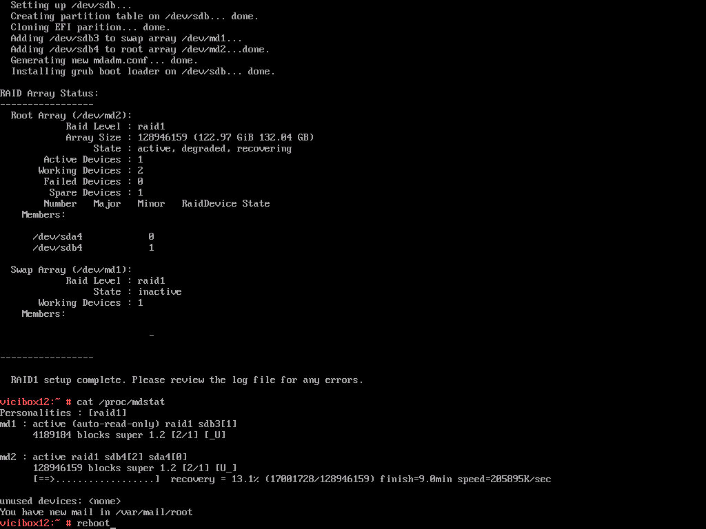

ViciBox 12.0.0 RAID Tool Bug
============================

If you applied updates before running the RAID setup during the first login, you likely do not have this issue.

The ViciBox MDRAID1 tool (``vicibox-mdraid1``) had an issue where previous MD RAID arrays could interfere with the expected partitioning layout. The Linux kernel autoassembles any MD RAID arrays it finds from leftover metadata, resulting in orphaned arrays like /dev/md126, /dev/md127, etc. The fix is to temporarily stop all orphaned RAID arrays on the system during RAID setup.

A second issue relates to reinstalling the OS. If you don't wipe the metadata from the drives, you may get zombie arrays—previous OS arrays mounted under the new OS. For example, after installing ViciBox 12, only /dev/md2 (the root array with /dev/sda4) should exist under ``/proc/mdstat``. With a zombie array (e.g., from a previous ViciBox 11 install), you would see /dev/md1 also listed as read-only with /dev/sdb3 as the device. This is mitigated by checking if /dev/sdb3 (the target swap partition) already exists in /dev/md1 (the swap array). If it does, the swap array is stopped and the script can create it properly.
   
Symptoms
--------

With the version of vicibox-mdraid1 included with the ViciBox v.12.0.0 image, you can potentially end up with an improperly set up swap array. If you look at the output of ``/proc/mdstat`` and see /dev/md1 listed as (auto-read-only), that is a good indication you have this issue. The screenshot below shows an example: on a newly installed ViciBox v.12.0.0 system without updates, the root array contains /dev/sda4 and the swap array contains /dev/sdb3.

   Zombie RAID from previous ViciBox install

The Fix
-------

   It is important to determine the correct partitions to be used for the swap array. By default, the third partition in the image is used for swap. In the above screenshot, /dev/sda3 and /dev/sdb3 would be the swap partitions since we have /dev/sda and /dev/sdb shown. If you have NVMe drives then it would most likely be /dev/nvme0n1p3 and /dev/nvme1n1p3 for swap partitions. This will **highly** depend on your install and drives used. Below are the commands that would be used to fix the above screenshot.

   .. code-block:: bash
      :caption: Create proper swap partition

      swapoff -a
      mdadm --stop /dev/md1
      mdadm --create --force /dev/md1 --level=1 --raid-devices=2 --metadata=1.2 /dev/sda3 /dev/sdb3
      mkswap /dev/md1
      sed -i '/swap/ s/^/#/' /etc/fstab
      echo "UUID=$(blkid -s UUID -o value /dev/md2) swap swap defaults 0 0" >> /etc/fstab
      swapon -a
      cat /proc/mdstat

