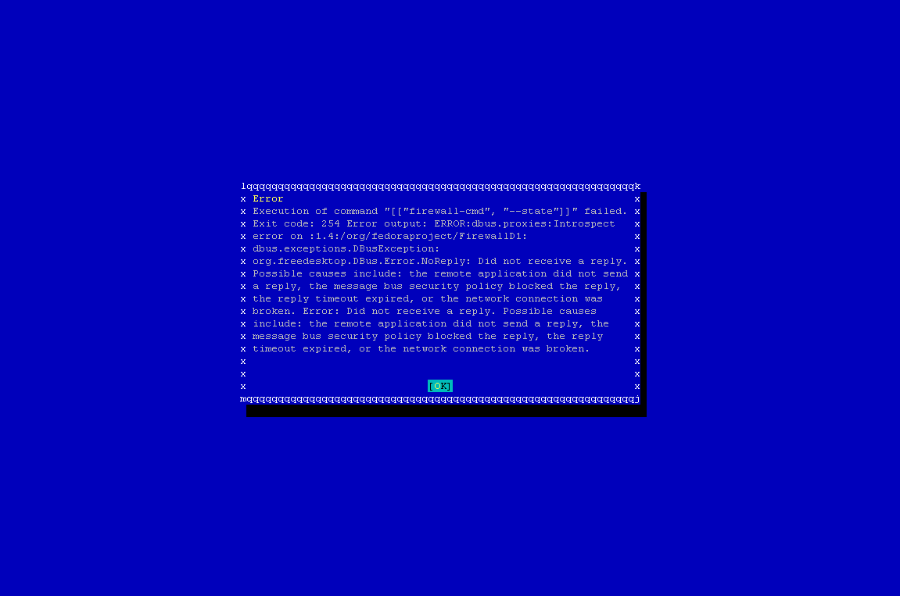

=================
12.0.1 YaST error
=================

In /etc/firewalld/zones/external.xml the 'ssh' service is listed twice. FirewallD doesn't care and just silently ignores it. YaST, on the other hand, has a meltdown. This is a bug in the YaST firewall module and not a bug in ViciBox. The fix is to remove the duplicate 'ssh' service from the external zone so yast doesn't get confused.

Symptoms
--------
The general sympton is you'll launch ``yast firewall`` or go into the firewall module and things will hang for a while before presenting you with the below error at some point.

   
   YaST firewall issue

The Fix
-------
If you apply updates with ``zypper up`` and you have no customized firewall settings you'll miss, you can simply copy the new external.xml zonefile over the old one. If you have customized firewall settings, you'll need to manually edit the external.xml file and remove the duplicate 'ssh' service or just modify the new one for your needs.

.. code-block:: bash
   :caption: Copy replacement file over old one

   zypper ref && zypper up
   cp /etc/firewalld/zones/external.xml.rpmnew /etc/firewalld/zones/external.xml

