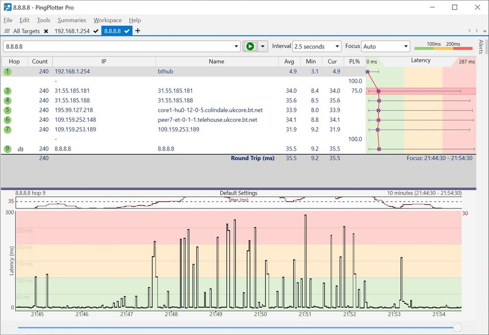

======
Jitter
======

Jitter is the difference between ping times to an endpoint over time. For example, if host A pings host B and gets 20ms, then pings them again 5 seconds later and gets a 30ms ping, the jitter is 10ms between host A and B. If you then repeat this every 5 seconds and average the results over 5 or so minutes you will get a good measurement of the networks jitter. All networks have a base level of jitter. The problem is when this jitter starts to exceed 100ms on average. This is where audio start to be affected.

Jitter mostly manifests in the audio as distorion. Common descriptions of the audio would be that it sounded 'muddy', 'underwater', or 'warped'. Sometimes it will also manifest as chirps or slurring. This is less common and can often be confused with packet loss.

High jitter spikes are usually attributed to network connections nearing their capacity. This causes buffering on the network interfaces which results in network delays. In our experience jitter is either happening in the middle of the network like with packet loss, or it's happening at the local router. If Jitter is happening in the middle of the internet then there is not much you can do but hurry up and wait. Things will usually clear out with time but it's not uncommon to have jitter be an issue for minutes to hours at a time.

If the jitter is happening at the network's local router then it's usually the result of a bandwidth restriction. High-bandwidth sites like YouTube and NetFlix or large file downloads like Windows Updates or automated backups can saturate the connection with the ISP. The solution is to either is to get more bandwidth and/or restrict what people should be accessing on the internet. If you have a more advanced router you can do things like bandwidth restrictions and block websites. Sometimes the issue is that the router is just overloaded. This is most common on the cheap routers. If you are running a mid-range router like an Asus RT-AC86U or better then the router is likely not an issue.

Example
-------
The screenshot shows bad jitter in the bottom graph. You can see the black lines go from around 35ms (the average ping time) to as high as 290ms every 5 seconds or so. This is excessively high jitter and this connection will have a bad audio. Also of note on this example is that hop 3 looks like it is experiencing packet loss but it's not. You can see that the next few hops after hop 3 do not show similar levels of packet loss. This means that hop 3 is just ignoring ping which is normal.

